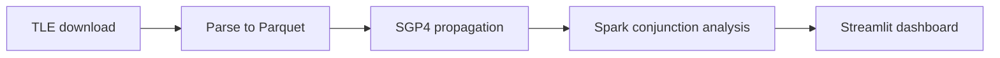

# Distributed Orbital Conjunction Analytics

A Spark and HDFS pipeline that downloads Two-Line Element data, propagates orbital states with SGP4, detects close approaches between orbital objects, and presents the results in a Streamlit dashboard.

## Pipeline



The cluster execution documented in [`docs/BDA_FINAL.pdf`](docs/BDA_FINAL.pdf) parsed 15,487 TLE records and produced 427 conjunction events. The conjunction-analysis stage completed in approximately 13 minutes on three Spark workers with 84 allocated cores.

## Repository structure

```text
app/dashboard.py                  Streamlit dashboard
scripts/download_tle.py           TLE ingestion
scripts/parse_tle.py              TLE parsing and Parquet conversion
scripts/propagate_sgp4.py         Seven-day SGP4 propagation
scripts/check_conjunctions.py     Spark conjunction analysis
pipeline.py                       Daily pipeline orchestration
data/sample_conjunctions.csv      Local dashboard sample
docs/BDA_FINAL.pdf                Project report and cluster evidence
```

## Run the dashboard locally

```bash
python -m venv .venv
source .venv/bin/activate
pip install -r requirements.txt
CONJUNCTION_DATA_PATH=data/sample_conjunctions.csv streamlit run app/dashboard.py
```

## Run the distributed pipeline

The cluster path expects Hadoop 3.3, Spark 3.5, Java 11, Python 3.10, HDFS access, and a SATCAT CSV at `/user/bda/satcat/satcat.csv`.

```bash
python pipeline.py
```

The pipeline writes date-partitioned datasets under:

```text
/user/bda/tle/raw/<DATE>
/user/bda/tle/processed/<DATE>
/user/bda/tle/positions/<DATE>
/user/bda/tle/conjunctions/<DATE>
```

## Analysis

For each common timestamp, the Spark job:

1. Generates unique object pairs.
2. Excludes debris-debris comparisons.
3. Filters pairs within 5 km.
4. Calculates relative velocity.
5. Groups consecutive detections into conjunction events.
6. Selects the timestamp associated with minimum separation.
7. Enriches results with SATCAT owner metadata.

The output is a deterministic close-approach analysis, not a probabilistic collision model.

## Test

```bash
pytest
```

## Limitations

- Pair generation remains quadratic within each timestamp.
- SGP4 accuracy depends on TLE freshness and is not a substitute for operational ephemeris data.
- Severity ranking is distance-based and does not estimate collision probability.
- The distributed pipeline requires an existing Spark and HDFS cluster.
